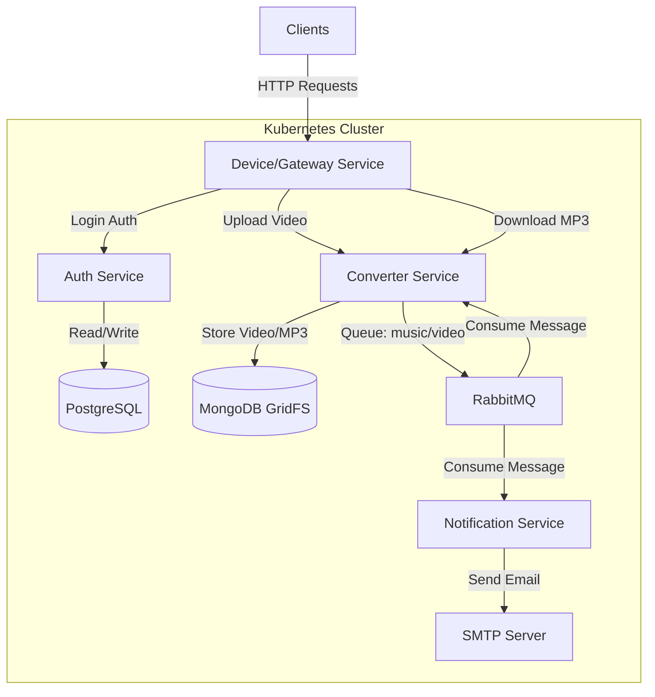

# Devops Project: video-converter
Converting mp4 videos to mp3 in a microservices architecture.

## Architecture



## Deploying a Python-based Microservice Application on AWS EKS

### Introduction

This document provides a step-by-step guide for deploying a Python-based microservice application on AWS Elastic Kubernetes Service (EKS). The application comprises four major microservices: `auth-server`, `converter-module`, `database-server` (PostgreSQL and MongoDB), and `notification-server`.

### Prerequisites

Before you begin, ensure that the following prerequisites are met:

1. **Create an AWS Account:**
2. **Install Helm:**
3. **Python:**
4. **AWS CLI:** 
5. **Install kubectl:** 
6. **Databases:**
   
### High Level Flow of Application Deployment

Follow these steps to deploy your microservice application:

1. **MongoDB and PostgreSQL Setup:** Create databases and enable automatic connections to them.

2. **RabbitMQ Deployment:** Deploy RabbitMQ for message queuing, which is required for the `converter-module`.

3. **Create Queues in RabbitMQ:** Before deploying the `converter-module`, create two queues in RabbitMQ: `mp3` and `video`.

4. **Deploy Microservices:**
   - **auth-server:** Navigate to the `auth-server` manifest folder and apply the configuration.
   - **gateway-server:** Deploy the `gateway-server`.
   - **converter-module:** Deploy the `converter-module`. Make sure to provide your email and password in `converter/manifest/secret.yaml`.
   - **notification-server:** Configure email for notifications and two-factor authentication (2FA).

5. **Application Validation:** Verify the status of all components by running:
   ```bash
   kubectl get all
   ```

6. **Destroying the Infrastructure** 


### Low Level Steps

#### Cluster Creation

1. **Log in to AWS Console:**
  
2. **Create eksCluster IAM Role**

3. **Create Node Role - AmazonEKSNodeRole**

4. **Open EKS Dashboard:**

5. **Create EKS Cluster:**

6. **Cluster Creation:**

7. **Cluster Ready:**

#### Node Group Creation

1. In the "Compute" section, click on "Add node group."

2. Choose the AMI (default), instance type (e.g., t3.medium), and the number of nodes (attach a screenshot here).

3. Click "Create node group."

#### Adding inbound rules in Security Group of Nodes

**NOTE:** Ensure that all the necessary ports are open in the node security group.


#### Enable EBS CSI Addon
1. enable addon `ebs csi` this is for enabling pvcs once cluster is created


#### Deploying your application on EKS Cluster

1. Clone the code from this repository.

2. Set the cluster context:
   ```
   aws eks update-kubeconfig --name <cluster_name> --region <aws_region>
   ```

### Commands

Here are some essential Kubernetes commands for managing your deployment:


### MongoDB

To install MongoDB, set the database username and password in `values.yaml`, then navigate to the MongoDB Helm chart folder and run:

```
cd Helm_charts/MongoDB
helm install mongo .
```

Connect to the MongoDB instance using:

```
mongosh mongodb://<username>:<pwd>@<nodeip>:30005/mp3s?authSource=admin
```

### PostgreSQL

Set the database username and password in `values.yaml`. Install PostgreSQL from the PostgreSQL Helm chart folder and initialize it with the queries in `init.sql`. For PowerShell users:

```
cd ..
cd Postgres
helm install postgres .
```

Connect to the Postgres database and copy all the queries from the "init.sql" file.
```
psql 'postgres://<username>:<pwd>@<nodeip>:30003/authdb'
```

### RabbitMQ

Deploy RabbitMQ by running:

```
helm install rabbitmq .
```

Ensure you have created two queues in RabbitMQ named `mp3` and `video`. To create queues, visit `<nodeIp>:30004>` and use default username `guest` and password `guest`

**NOTE:** Ensure that all the necessary ports are open in the node security group.

### Apply the manifest file for each microservice:

- **Auth Service:**
  ```
  cd auth-service/manifest
  kubectl apply -f .
  ```

- **Gateway Service:**
  ```
  cd gateway-service/manifest
  kubectl apply -f .
  ```

- **Converter Service:**
  ```
  cd converter-service/manifest
  kubectl apply -f .
  ```

- **Notification Service:**
  ```
  cd notification-service/manifest
  kubectl apply -f .
  ```

Run the application through the following API calls:

# API Definition

- **Login Endpoint**
  ```http request
  POST http://nodeIP:30002/login
  ```

  ```console
  curl -X POST http://nodeIP:30002/login -u <email>:<password>
  ``` 
  Expected output: success!

- **Upload Endpoint**
  ```http request
  POST http://nodeIP:30002/upload
  ```

  ```console
   curl -X POST -F 'file=@./video.mp4' -H 'Authorization: Bearer <JWT Token>' http://nodeIP:30002/upload
  ``` 
  
  Check if you received the ID on your email.

- **Download Endpoint**
  ```http request
  GET http://nodeIP:30002/download?fid=<Generated file identifier>
  ```
  ```console
   curl --output video.mp3 -X GET -H 'Authorization: Bearer <JWT Token>' "http://nodeIP:30002/download?fid=<Generated fid>"
  ``` 
